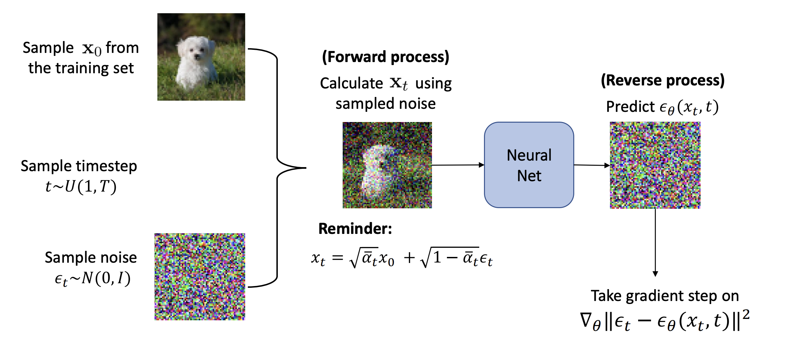
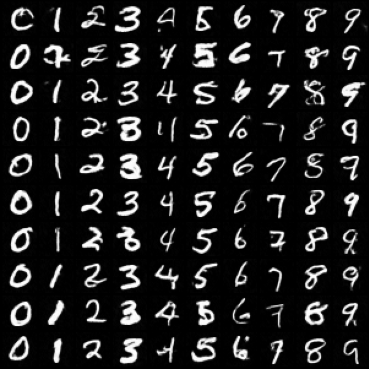
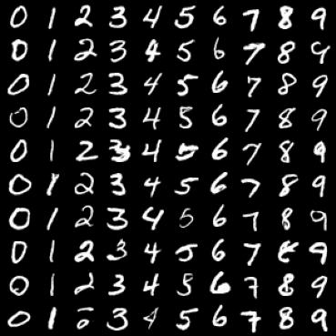
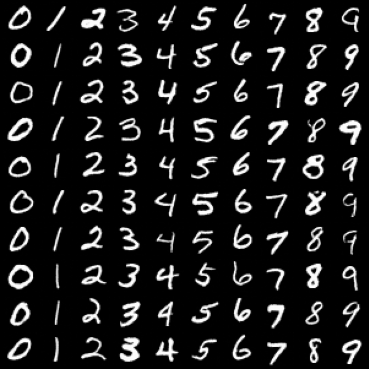
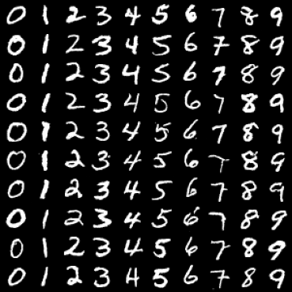

# Denoising-Diffusion-Probabilistic-Model



This project implements the models proposed in [ Denoising-Diffusion-Probabilistic-Model (DDPM)](https://arxiv.org/abs/2006.11239)
written by Jonathan Ho, Ajay Jain, and Pieter Abbeel.

The models were ran over the following dataset:
- MNIST

The results of the models can be found in [results.pdf](./results.pdf).







## Running the code
1. You can install the required libraries running
    ```bash
    pip install -r requirements.txt
    ```
2. Run:
    ```bash
    python3 train.py
    ```
