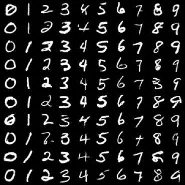

# Denoising Diffusion Probabilistic Model


This project implements the models proposed in [ Denoising-Diffusion-Probabilistic-Model (DDPM) paper](https://arxiv.org/abs/2006.11239)
written by Jonathan Ho, Ajay Jain, and Pieter Abbeel.

The models were ran over the following dataset:
- MNIST

The results of the models can be found in [results.pdf](./results.pdf).

Below are generated image samples from the DDPM and DDIM methods:

- DDIM (5 steps): Fewer denoising steps, resulting in quicker generation but slightly noisier images.

  

- DDIM (10 steps): Improved clarity over 5 steps while still maintaining fast sampling.

  

- DDIM (20 steps): Better image quality, showing clearer digits with fewer artifacts.

  

- DDIM (50 steps): Nearly matches the DDPM quality, producing very clean and sharp digits.

  

- DDPM Sample after 29 Epochs: A sample generated by the trained DDPM model after 29 epochs of training.

  

## Setup

### Prerequisites
- Python 3.x
- NumPy
- torch
- torchvision
- matplotlib

You can install the dependencies using:

```bash
pip install -r requirements.txt
```

## Running the code

To train the DDPM model on the MNIST dataset:

```bash
python main.py
```

You can customize training using the following command-line arguments:

| Argument       | Description                                 | Default |
|----------------|---------------------------------------------|---------|
| `--batch_size` | Number of images per mini-batch             | 128     |
| `--epochs`     | Number of training epochs                   | 30      |
| `--lr`         | Initial learning rate for the optimizer     | 1e-3    |

#### Example with Custom Parameters:

```bash
python main.py --batch_size 64 --epochs 50 --lr 0.0005
```

### Output Files

- Samples: After every epoch, an image grid of generated MNIST digits is saved in `./samples/` as `MNIST_{epoch}.png`.
- DDIM Samples: After training, DDIM samples are generated at steps `[5, 10, 20, 50]` and saved as `DDIM_{steps}.png` in the same folder.
- Losses: The training loss for each epoch is saved to a file named `loss_epochs.pkl`.

